<div align="center">


# Bird's Eye Finance

**Your finances, clearly seen.**

Android · Arabic & English · Local-first — your data never leaves your phone

</div>

---


## What it is

Bird's Eye Finance is a personal finance app built around two things most money apps get wrong: tracking **informal debts** (who you owe, who owes you) with the same care as your actual expenses, and never sending a single byte of your financial life to a server. Everything — every debt, every expense, every income source — lives only on your device.

## Screenshots

<div align="center">
<table>
<tr>
<td>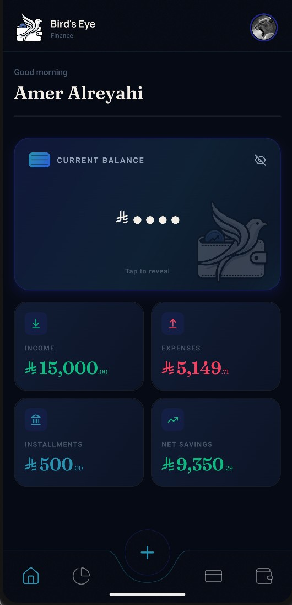</td>
<td>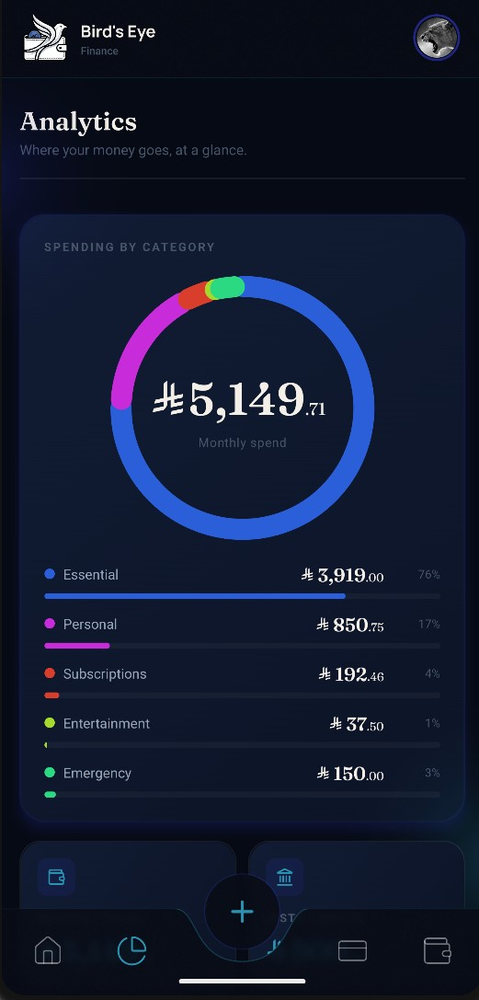</td>
<td>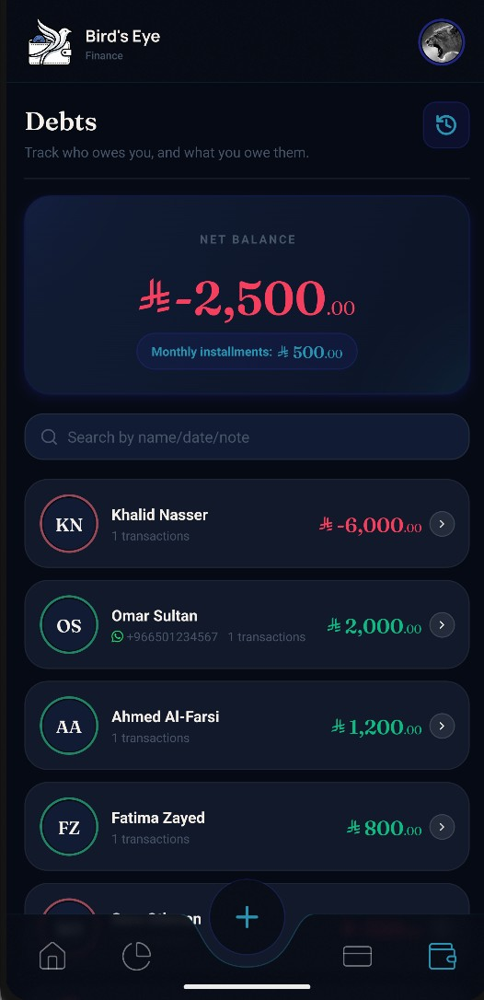</td>
</tr>
<tr>
<td align="center"><sub>Home</sub></td>
<td align="center"><sub>Analytics</sub></td>
<td align="center"><sub>Debts</sub></td>
</tr>
<tr>
<td>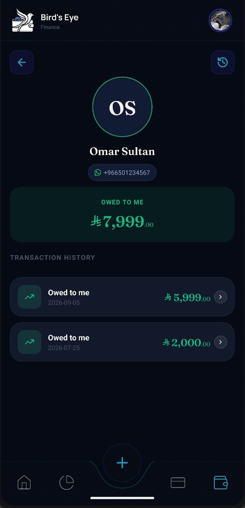</td>
<td>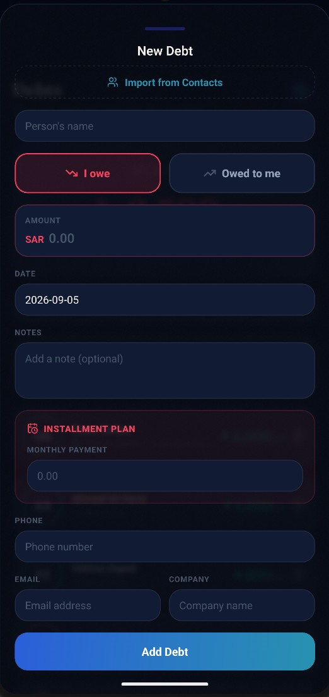</td>
<td>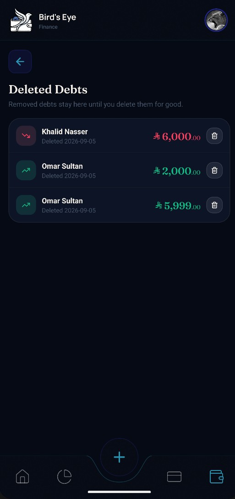</td>
</tr>
<tr>
<td align="center"><sub>Person detail</sub></td>
<td align="center"><sub>Add a debt</sub></td>
<td align="center"><sub>Deleted debts</sub></td>
</tr>
<tr>
<td>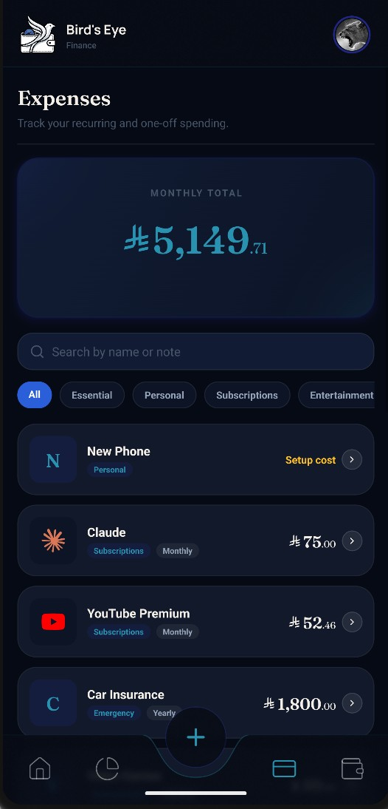</td>
<td>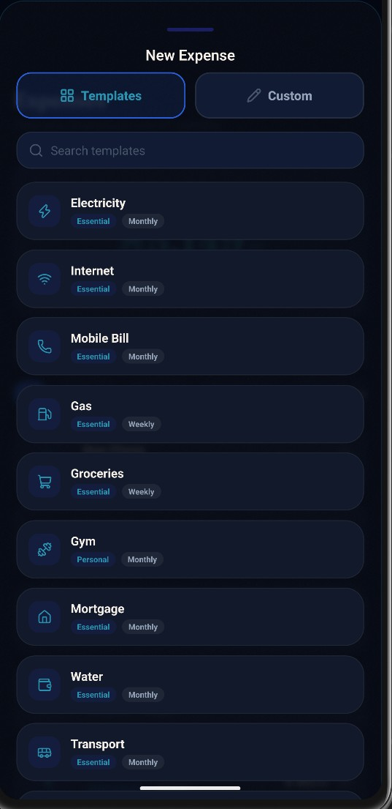</td>
<td>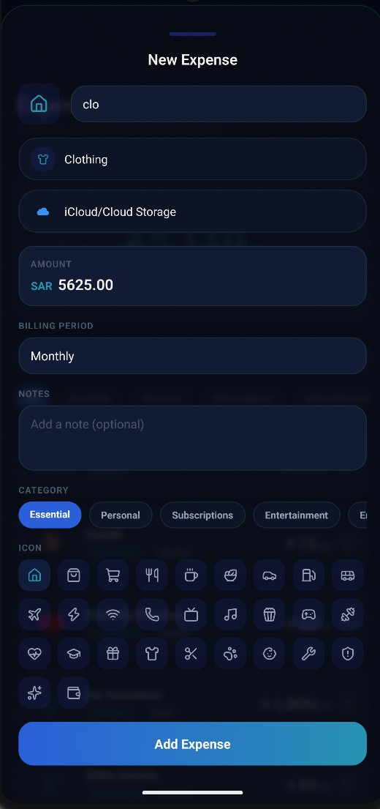</td>
</tr>
<tr>
<td align="center"><sub>Expenses</sub></td>
<td align="center"><sub>Expense templates</sub></td>
<td align="center"><sub>Custom expense</sub></td>
</tr>
<tr>
<td>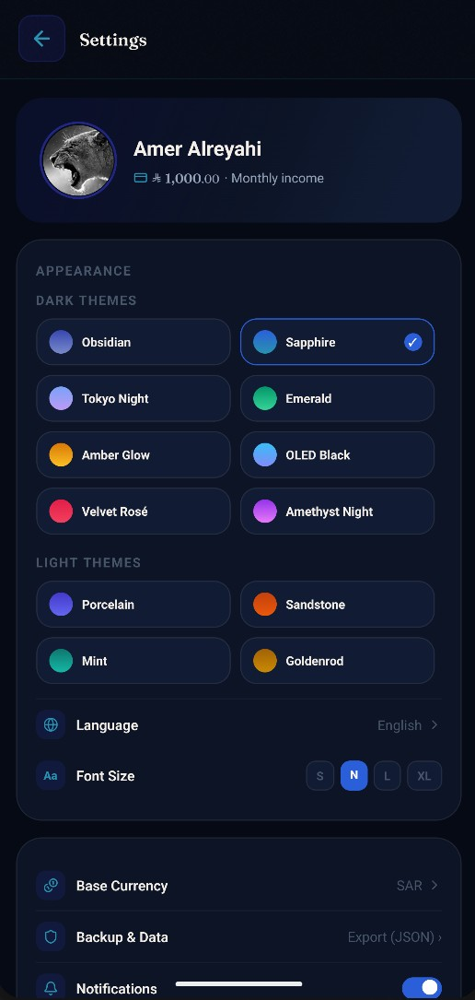</td>
<td>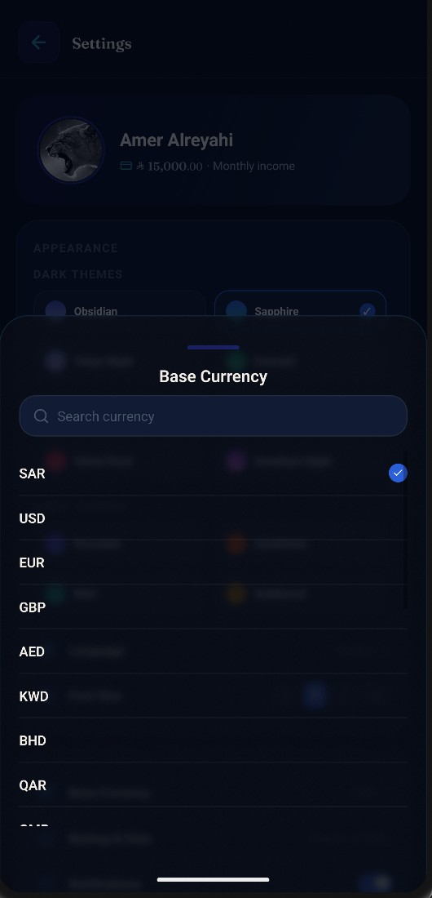</td>
<td>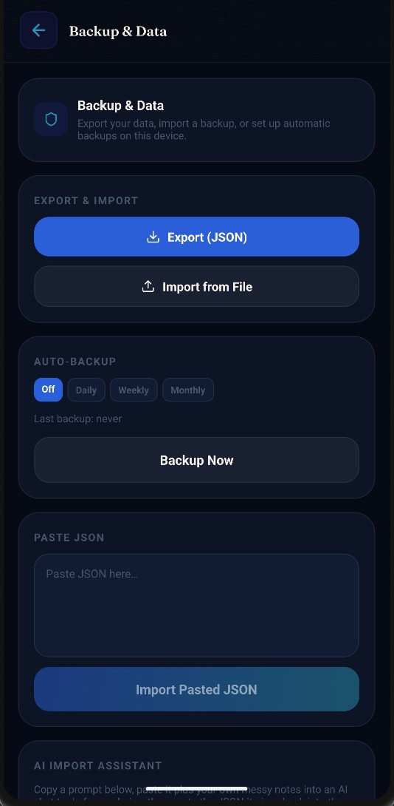</td>
</tr>
<tr>
<td align="center"><sub>Settings & themes</sub></td>
<td align="center"><sub>Currency picker</sub></td>
<td align="center"><sub>Backup & data</sub></td>
</tr>
</table>
</div>

## Features

### 🤝 Debts, done properly

Track money owed _to_ you and money you owe, per person — not just a single running balance. Link a debt straight to someone in your contacts (name, phone, and photo pulled in automatically), and message them their balance on WhatsApp with one tap. Installment plans (monthly payment, start/end date) are tracked separately from one-off amounts, so a loan repayment is never mistaken for discretionary spending in your totals. Deleted debts aren't gone for good — a dedicated history screen keeps them recoverable until you choose to erase them permanently.

### 💳 Expenses that recognize themselves

Pick from a library of common bills and subscriptions (electricity, internet, gym, groceries and more) already set up with the right category and icon, or start typing a custom name and matching brand icons and categories suggest themselves as you type. Every expense has a billing period (daily, weekly, monthly, yearly, or custom), so a small monthly subscription and a once-a-year bill both roll up correctly into one monthly total. Haven't decided the price of something yet? Add it as a placeholder "setup cost" and fill it in later — it won't be forgotten.

### 🏠 A home screen that answers "where am I?"

Your balance sits at the top, hidden until you tap it. Below it: what's coming up in the next 30 days — each installment falling due and any plan about to end, with the person and the amount — then this month at a glance (income, minus installments, minus expenses, and what's left, beside a savings-rate ring), and finally who owes you and who you owe. Tap anything to jump straight to it.

### 🔔 Reminders that know what you've already paid

Turn on notifications and the app reminds you before each installment falls due — on the day, a day before, or three days before, whichever you prefer — plus a heads-up a week before a plan ends. Record a payment and that month's reminder simply doesn't arrive. Everything is scheduled on your phone; nothing about your debts leaves it.

### 📊 Analytics that actually explain your money

A spending-by-category ring shows where your money goes at a glance, broken down by category with exact amounts and percentages, alongside your net savings — income minus expenses _and_ minus debt repayments, since a loan payment isn't optional spending.

### 🌐 Genuinely bilingual

Full Arabic and English support with real right-to-left layout — not a translated label bolted onto an English-only design. Every screen, every icon, every input mirrors correctly.

### 🎨 Sixteen themes, your choice

Eight dark themes and eight light ones — from moody Obsidian and Tokyo Night to bright Porcelain, Coastal and Matcha. Pick the one that fits your taste and every card, chart, and button follows it, instantly.

### 🔒 Local-first, always

No account, no login, no backend. Your debts and expenses live only on your device — nothing about you or your data is ever uploaded anywhere. Export everything to a JSON file whenever you want, and import one just as easily. There are three deliberate exceptions, none of which sends anything about you: a set of copy-paste prompts for importing messy notes via an AI assistant of your choosing (a manual, user-initiated action); a download of public exchange rates when the app starts; and a once-a-day check of this repository's releases for a newer version. The last two are plain requests to a fixed address — identical for every user — and both can be turned off in Settings.

### 💱 150+ currencies, one base

Every amount can be entered in its own original currency — any of 153 world currencies — and still rolls up correctly into your chosen base currency, using up-to-date daily exchange rates. The currency picker learns from you — whichever currencies you actually use rise to the top of the list over time — and you can search it by code or by name.

---

## Install

**[⬇ Download the latest release](../../releases/latest)** — grab the APK, transfer it to your Android phone, and open it. You'll need to allow "install from unknown sources" for whichever app you use to open it (Files, a browser, etc.) — Android will prompt you for this the first time.

From 2.2.0 onwards you only have to do that once: the app checks this page for newer versions by itself, and Settings → App updates downloads and installs them for you. It refuses to install anything that isn't this app, signed with the same key, matching the checksum published with the release — and your data is untouched by an update.

Want an older version instead? **[Browse all releases](../../releases)** and pick one.

No Play Store, no account, no setup beyond that.

## Building from source

> [!IMPORTANT]
> **Read [docs/DEVELOPMENT.md](./docs/DEVELOPMENT.md) before your first build.** This is a native Android project — `npm install` alone will not get it running. There are real prerequisites (Android Studio/SDK, a JDK, `ANDROID_HOME`) covered there in full, along with the complete project structure, release-signing caveats, and the current state of CI/CD.

```bash
npm install
npx expo run:android
```

That's the short version once the prerequisites above are met — it builds and installs a debug build on a connected device or emulator.

---

<div align="center">
<sub>Built with Expo &amp; React Native.</sub>
</div>
