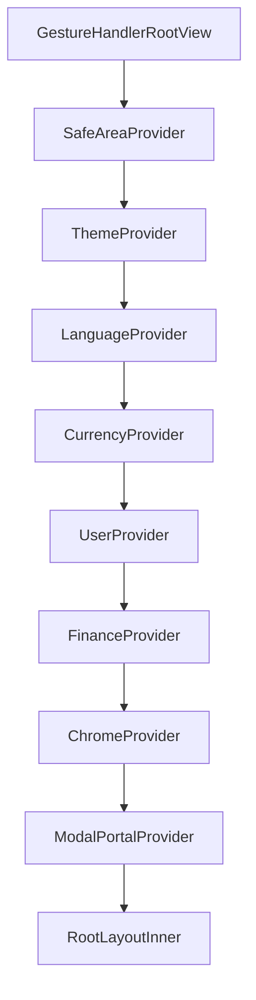

# Developer Guide

This is the engineering-facing companion to the [README](../README.md) — how the app is put together, how to build it, and what's already been learned the hard way. If you just want to install and use the app, the README's [Releases page](../../../releases) link is all you need; everything below is for working on the source.

Read this alongside [`FEATURE_SPEC.md`](./FEATURE_SPEC.md) (what every screen does) and [`PHASES.md`](./PHASES.md) (build history / what's done). The root [`CLAUDE.md`](../CLAUDE.md) is the binding architecture-rules doc — this file explains *how the rules play out in the actual code*, not a replacement for it.

## Table of contents

- [Common commands](#common-commands)
- [Prerequisites](#prerequisites)
- [Getting started](#getting-started)
- [Project structure](#project-structure)
- [App boot sequence & provider tree](#app-boot-sequence--provider-tree)
- [Path aliases](#path-aliases)
- [Data layer](#data-layer)
- [Theming & the glass effect](#theming--the-glass-effect)
- [Internationalization / RTL](#internationalization--rtl)
- [Testing on a device or emulator](#testing-on-a-device-or-emulator)
- [Release builds](#release-builds)
- [CI/CD](#cicd)
- [Known gotchas & lessons already learned](#known-gotchas--lessons-already-learned)

---

## Common commands

Run from the project root. Details for each are further down this guide.

| Task | Command |
|---|---|
| Install dependencies (after cloning, or when dependencies changed) | `npm install` |
| Build and run the dev app on a connected device / emulator | `npm run android` |
| Start the dev server for an already-installed dev build | `npm start` |
| **Build a release APK** — regenerates `android/`, builds, copies the APK to `apk/` | `npm run release:android` |
| Regenerate `android/` only (after `app.json` or native-dependency changes) | `npm run prebuild:android` |
| Typecheck + lint — run before calling any change done | `npm run check` |
| Typecheck only / lint only | `npm run typecheck` / `npm run lint` |
| Format every file / check formatting | `npm run format` / `npm run format:check` |
| Generate a DB migration after editing `src/db/schema.ts` | `npm run db:generate` |
| Rebuild the curated brand-icon list | `npm run brandicons` |

- A release APK lands at `apk/birdsEyeFinance_V<version>.apk`. Before building one, bump the version and follow [Release builds](#release-builds) (the GitHub Release tag must be exactly `v<version>`).
- `npm run format:check` still reports 5 files that predate Phase 6 (README.md, Header.tsx, DonutChart.tsx, MoneyAmount.tsx, CurrencyContext.tsx).

---

## Prerequisites

This is a **bare/prebuilt Expo project** (the `android/` folder is real, generated native code — not a managed-workflow black box), so you need the full native Android toolchain, not just Node:

| Requirement | Notes |
|---|---|
| **Node.js** | No version pinned in `package.json` (`engines` isn't set). Anything reasonably current works — this was developed against Node 24. |
| **npm** | Comes with Node. The project uses `package-lock.json`, not yarn/pnpm. |
| **JDK** | 17 or newer. Confirmed working with JDK 21. |
| **Android Studio + Android SDK** | Needed for `adb`, the emulator, and the SDK/build-tools versions the Gradle build resolves at build time. Standard React Native setup — see [reactnative.dev's environment setup](https://reactnative.dev/docs/environment-setup) if you've never done this before. |
| **`ANDROID_HOME` / `local.properties`** | `npx expo run:android` (or a plain `./gradlew` invocation) needs to find your SDK. Either set `ANDROID_HOME` in your shell profile, or Android Studio will generate `android/local.properties` for you the first time you open the project there. |
| **A device or emulator** | A physical Android phone with USB debugging on, or an AVD from Android Studio's Device Manager. |
| **Xcode (macOS only)** | Only if you ever build for iOS — nothing in this repo has been tested on iOS yet, despite `ios`-flavored config existing in `app.json`. |

There is **no `.env` file, no API keys, no backend credentials to configure** — this is a fully local-first app (see CLAUDE.md rule 1). If a build fails, it's almost always a native-toolchain problem (SDK version, JDK version, `ANDROID_HOME`), not a missing secret.

## Getting started

```bash
git clone <this-repo>
cd Bird_Eye
npm install
npx expo run:android
```

The first run builds the native Android project (this can take several minutes) and installs a **debug** build on whatever device/emulator `adb` sees. Subsequent runs are much faster since Gradle caches the native build.

Useful scripts already defined in `package.json`:

```bash
npm run android      # expo run:android
npm run lint         # eslint .
npm run typecheck    # tsc --noEmit
npm run format       # prettier --write .
npm run db:generate  # drizzle-kit generate (after changing src/db/schema.ts)
npm run brandicons   # regenerates src/constants/brandIcons.ts from scripts/buildBrandIcons.ts
```

Run `lint` and `typecheck` before considering any change done — CLAUDE.md rule 11 treats both as a hard gate, not a suggestion.

## Project structure

A quick map first, details below it — this is short on purpose, don't read the explanations off this block:

```
app/                Expo Router routes (thin — mostly re-export a screen)
├─ (tabs)/          Dashboard, Analytics, Expenses, Debts
├─ settings/        Settings hub + edit-profile, data sub-screens
├─ about.tsx
└─ _layout.tsx      Provider tree, Stack, Header/Navbar mounting

src/
├─ pages/           The real screen implementations
├─ components/      App-specific composed components
│  └─ ui/           26 shared, theme-driven primitives
├─ context/         7 React Contexts
├─ db/              Drizzle schema, client, migrations
├─ constants/       theme.ts, translations.ts, currencies.ts, ...
├─ utils/           autoBackup, color, expenseIcon, whatsapp
├─ prompts/         AI-import prompt templates
└─ lib/mmkv.ts      The one MMKV instance + typed storage keys

scripts/            One-off build-time scripts, not part of the app
docs/               This file, FEATURE_SPEC.md, PHASES.md, gallery/
android/            Generated native project (gitignored)
```

**What's in each folder:**

- **`app/`** — Expo Router routes. Thin: mostly just re-exports a screen component from `src/pages`. `_layout.tsx` is the one exception — it owns the whole provider tree, the route `Stack`, and mounts `Header`/`Navbar` (see [App boot sequence](#app-boot-sequence--provider-tree) below).
- **`src/pages/`** — the real screen implementations; what `app/`'s routes point at.
- **`src/components/`** — app-specific composed components (`DebtModal`, `ExpenseModal`, `Header`, `Navbar`, ...). Its `ui/` subfolder holds **26 shared, theme-driven primitives** (CLAUDE.md rule 4) — every screen composes these; nothing hardcodes a color or duplicates another screen's pattern. *(Rule 4's original list names 18 of them; `BalanceRevealCard`, `DonutChart`, `GlowBlob`, `ListCard`, `MoneyAmount`, `ProgressBar`, `RingGauge`, and `StatTile` were added afterward and aren't in that enumeration — the code is the source of truth, not the rule's original list.)*
- **`src/context/`** — 7 React Contexts; see the provider-tree diagram below for what each one owns.
- **`src/db/`** — `schema.ts` (Drizzle table definitions: `expenses`, `debts`, `incomeSources`), `client.ts` (expo-sqlite + Drizzle setup), `migrations/` (drizzle-kit-generated SQL — never hand-edit, run `npm run db:generate` instead).
- **`src/constants/`** — `theme.ts` (the 12 locked color palettes + design tokens: `RADII`, `SEMANTIC`, `FONTS`, `GLASS_*`), `translations.ts` (flat key → `{ en, ar }` dictionary), `currencies.ts` (20-currency static reference table), `brandIcons.ts` (generated — curated icon subset from simple-icons), `initialData.ts` (default `Profile` shape), `fontScale.ts` (accessibility multipliers).
- **`src/utils/`** — `autoBackup.ts` (export/import/backup snapshot logic), `color.ts` (`hexToRgb`, chrome-alpha constants for the glass effect), `expenseIcon.ts` (name-autocomplete → icon matching), `whatsapp.ts` (`openWhatsApp()` deep link).
- **`src/prompts/`** — `debtsPrompt.ts`, `expensesPrompt.ts`: copy-paste prompts for the AI-import workflow (CLAUDE.md rule 1).
- **`src/lib/mmkv.ts`** — the single `react-native-mmkv` instance, typed `StorageKeys`, and `getJSON`/`setJSON` helpers.
- **`scripts/`** — one-off build-time scripts (brand icon curation); not part of the shipped app.
- **`docs/`** — this file, `FEATURE_SPEC.md`, `PHASES.md`, `gallery/` (the README's screenshots).
- **`android/`** — the generated native Android project. Gitignored — don't hand-edit it expecting changes to survive `expo prebuild --clean` — nothing in it is hand-edited; the release-APK output step comes from `plugins/withReleaseApk.js` (see [Release builds](#release-builds)).

## App boot sequence & provider tree

Everything starts in `app/_layout.tsx`. The provider nesting order is deliberate — each one either reads from MMKV synchronously before first paint, or depends on a provider above it:



What each provider actually owns, outer to inner:

- **ThemeProvider** — reads the theme id from MMKV *synchronously* (rule 2: no flash of wrong colors on cold start).
- **LanguageProvider** — reads language from MMKV; drives `I18nManager`'s native RTL flip.
- **CurrencyProvider** — reads base currency + per-currency usage counts from MMKV.
- **UserProvider** — reads the `Profile` blob from MMKV.
- **FinanceProvider** — owns the live SQLite queries (debts/expenses/income). Needs `CurrencyProvider` above it for `convertToBase()`.
- **ChromeProvider** — header/navbar heights, the shared `blurTarget` ref, the FAB handler.
- **ModalPortalProvider** — the portal every `GlassModal` instance renders into.
- **RootLayoutInner** — waits on custom fonts, then hides the splash screen.

Inside `RootLayoutInner`:
1. `BlurTargetView` (from `expo-blur`) wraps the route `Stack` — this is the one View every glass `BlurView` in the app points at via `ChromeContext`'s `blurTarget` ref, because Android's real blur methods need an explicit target to sample (they can't auto-blur "whatever's behind" the way iOS can).
2. `<Header />` and `<Navbar />` are mounted **after** the `Stack`, as siblings — not inside it, and not as `(tabs)`'s own tab-bar slot. Nesting either inside the `Stack`/tab-bar would put them inside the very content their own `BlurView` needs to blur, which silently degrades to a flat tint on Android instead of a real blur.
3. `<ModalPortalOutlet />` renders last, so anything shown through `ModalPortalContext` (every `GlassModal`-based sheet — `DebtModal`, `ExpenseModal`, `ConfirmModal`, `CustomSelect`'s sheet, `ContactsPicker`) paints above the header/navbar too, and can share the same `blurTarget`. This exists specifically because React Native's own `Modal` component renders into a separate native window that can't reach `blurTarget` at all — see `GlassModal.tsx`'s own comments for the full reasoning.

## Path aliases

Defined in `tsconfig.json`, all rooted at `src/`:

```ts
"@/*": ["./src/*"]
"@/components/*": ["./src/components/*"]
"@/context/*": ["./src/context/*"]
"@/db/*": ["./src/db/*"]
"@/constants/*": ["./src/constants/*"]
```

In practice `@/*` alone covers everything (`@/utils/color`, `@/lib/mmkv`, `@/pages/Debts`, etc.) — the more specific aliases just exist for slightly shorter imports on the most common ones.

## Data layer

Two persistence mechanisms, used for two different kinds of data (CLAUDE.md rule 1):

- **Relational data** (debts, expenses, income sources) → `expo-sqlite` via **Drizzle ORM**, typed schema in `src/db/schema.ts`, migrations generated by `drizzle-kit` (`npm run db:generate`) and applied automatically at app start via `drizzle-orm/expo-sqlite/migrator`'s `useMigrations` hook (see `FinanceContext.tsx`). Live-updating queries come from `drizzle-orm/expo-sqlite`'s `useLiveQuery`, so any insert/update/delete anywhere in the app reactively updates every screen reading that table — no manual refetch anywhere.
- **Preferences** (theme id, language, base currency, currency usage counts, font scale, the Profile blob, active/previous tab, settings sub-screen, auto-backup meta+snapshot) → `react-native-mmkv`, one instance (`src/lib/mmkv.ts`), synchronous reads so theme/language are correct on the very first frame. `StorageKeys` is the single source of truth for every key string used — always add new keys there, never inline a string literal.

**Export / import / backup** (`src/utils/autoBackup.ts`) all funnel through one `BackupSnapshot` shape:

```ts
interface BackupSnapshot {
  expenses: Expense[];
  debts: Debt[];
  incomes: IncomeSource[];
  profile: Partial<Profile>;
  currency: string;
  theme: string;
  exportedAt: string;
}
```

`parseSnapshot()` is deliberately tolerant — it also accepts a *partial* object with just `{ debts: [...] }` or `{ expenses: [...] }`, which is exactly the shape the AI-import prompts (`src/prompts/`) instruct an external LLM to produce. A full backup file and a pasted AI-generated fragment go through the exact same parser and the exact same `appendSnapshot()`/`replaceWithSnapshot()` insert logic.

## Theming & the glass effect

- `src/constants/theme.ts` exports `THEMES`, currently **12 palettes** (`obsidian`, `sapphire`, `porcelain`, `sandstone`, `sage`, `tokyoNight`, `emerald`, `amberGlow`, `oledBlack`, `rosePine`, `amethyst`, `goldenrod`) — 8 dark, 4 light. CLAUDE.md rule 3 still describes the original 4 from Phase 1 (Platinum/Emerald/Obsidian/Sapphire) — the palette set has grown well past that since; treat `theme.ts` itself as ground truth for what exists, and its own rule-3 status as "frozen once you touch it, not a fixed count."
- **The glassmorphism effect** (`GlassHeader`, `Navbar`'s bar, `GlassModal`, and the FAB) is always the same recipe: a real `expo-blur` `BlurView` (`intensity={GLASS_BLUR_INTENSITY}`, `blurMethod={ANDROID_BLUR_METHOD}`, `blurTarget` from `ChromeContext`) layered under a `theme.ground`-at-`CHROME_GROUND_ALPHA` wash (`src/utils/color.ts`). Never approximate this with a flat tinted View — the whole point is that content visibly scrolls/blurs underneath it.
- **Do not combine a `BlurView` with `overflow: 'hidden'` and Android's `elevation` prop on the same node or its parent** — see [Known gotchas](#known-gotchas--lessons-already-learned) below. This has caused a real native crash twice.

## Internationalization / RTL

`LanguageContext` drives **both** mechanisms at once, not just one:
- Native RTL: `I18nManager.allowRTL(true)` at module load, then `I18nManager.forceRTL(isRTL)` / `swapLeftAndRightInRTL(isRTL)` on language change — this physically mirrors `flexDirection: 'row'` layouts.
- Logical properties on top: `paddingStart`/`paddingEnd`, `start`/`end` instead of hardcoded `left`/`right` in individual component styles (CLAUDE.md rule 9).

`translations.ts` is a flat `Record<string, string>` per language, looked up by `t(key, vars?)` with `{{var}}` interpolation. There's no nested-namespace structure — keys are just dotted strings (`'debtModal.saveButton'`) for readability, not real nesting.

One deliberate exception to RTL mirroring: the FAB stays at a fixed physical screen position regardless of language, and money amounts are always rendered with a forced `direction: 'ltr'` internally (see `MoneyAmount.tsx`) so a negative sign stays glued to the true left edge of the digits rather than being dragged around by the app's RTL flip.

## Testing on a device or emulator

```bash
npx expo run:android
```

This is a real dev-client build (not Expo Go) — required because the app uses native modules Expo Go doesn't ship (contacts, image manipulation, background tasks). Specifically:

> **Notifications and background debt-deadline re-evaluation (CLAUDE.md rule 10) cannot be verified in Expo Go at all**, and are unreliable even in some dev-client scenarios. Test that feature specifically on a real **EAS Development Build** or a from-source `run:android` build, never report it "done" from anything less.

The emulator is fine for almost everything, but it has a **much larger available heap than most real phones**. Anything that's actually about memory pressure (see the avatar-picker crash below) will pass silently on the emulator and still fail on a real device — don't treat "works on the emulator" as sufficient proof for image-handling or picker-related changes.

## Release builds

```bash
cd android && ./gradlew assembleRelease
```

Or, equivalently — also installs the result on a connected device/emulator afterward:

```bash
npx expo run:android --variant release
```

Release APK output comes from a local config plugin, **`plugins/withReleaseApk.js`** (registered in `app.json`), which appends a Gradle task to the generated `android/app/build.gradle` on every prebuild: after `assembleRelease`, `copyReleaseApkToRoot` copies `app-release.apk` into an `apk/` folder at the project root as **`birdsEyeFinance_V<versionName>.apk`**. The build output itself keeps Android's default name, so `expo run:android --variant release` can still find and install it. `apk/` is gitignored — upload the file as a binary asset on a new [GitHub Release](../../../releases/new) rather than committing it (GitHub hard-rejects any file over 100MB, and this APK is already well past that).

**Cutting a release:**

1. **Agree on the version number first** — a Claude session proposes it and waits for confirmation before touching anything (CLAUDE.md rule 17). Convention: small updates and fixes bump the patch (`2.0.1` → `2.0.2`); bigger feature releases bump the minor (`2.0.x` → `2.1.0`). Then update, in `app.json` only:
   - `expo.version` — the version users see (e.g. `2.0.1`). About reads it through `expo-constants`, the generated `android/app/build.gradle` takes `versionName` from it, and the APK filename follows it.
   - `expo.android.versionCode` — increase by 1 on every release (e.g. `1` → `2`), even if only `version` changed.

   Don't edit `package.json`'s `version` (it isn't the app version) or anything inside `android/`. Add a "Release x.y.z" entry to `docs/PHASES.md`.
2. Regenerate the native project so the version, splash, permissions and plugins actually reach it:
   ```bash
   npx expo prebuild --platform android --clean
   ```
   `--clean` is safe: nothing in `android/` is hand-edited anymore. Don't skip this step: `npx expo run:android` on its own does **not** re-apply `app.json` changes to an `android/` folder that already exists, so it would build with the old version, splash and permissions.
3. Build (and install on a connected device):
   ```bash
   npx expo run:android --variant release
   ```
   Steps 2 and 3 in one go: `npm run release:android`.
4. Upload `apk/birdsEyeFinance_V<version>.apk` to a new GitHub Release whose **tag and title are exactly `v<version>`** — the same version as `app.json` and the APK filename (e.g. tag `v2.0.1` for `birdsEyeFinance_V2.0.1.apk`). A mismatched tag misleads users, and would break any future update check that compares the latest tag with the installed version.

**Things to know:**

- **`android/` is gitignored and fully generated.** Never hand-edit it expecting the change to last — `prebuild --clean` wipes it. Until 2.0.1 the APK rename/copy lived as a direct edit there and was lost to a clean prebuild; it now lives in the plugin. Anything else that must survive belongs in a config plugin too.
- **Release builds are signed with the debug keystore.** `android/app/build.gradle`'s `release` build type explicitly points `signingConfig signingConfigs.debug` at `android/app/debug.keystore`, with a code comment ("Caution! In production, you need to generate your own keystore file") that's never actually been acted on. This is fine for sideloading APKs the way this project currently distributes them, but **this build is not Play-Store-distributable and not meaningfully more secure than a debug build** — anyone with the (checked-in, well-known) debug keystore could resign an update. Generating a real release keystore and wiring it in is a prerequisite for any distribution channel beyond "hand someone the APK."
- **`versionCode` lives in `app.json`** (`android.versionCode`, `2` as of 2.0.1). Sideloading doesn't enforce it, but increase it with every release anyway — the Play Store requires it, and `versionName` alone isn't what the Store tracks.

## CI/CD

**There is currently no CI/CD pipeline at all** — no `.github/workflows`, no `eas.json`, no `eas-build`/hosted build integration of any kind. Every build (dev or release) happens locally on a developer's machine via the commands above. This is worth stating plainly rather than leaving implicit, since it means:

- Nothing currently blocks a broken `lint`/`typecheck` from landing on `master` — CLAUDE.md rule 11's "must pass before any phase is complete" is enforced by convention/discipline only, not by tooling.
- Every release APK is hand-built locally and hand-uploaded to a GitHub Release by whoever runs `assembleRelease` — there's no automated build-on-tag or build-on-push, and no automated release-asset upload either.
- There's no automated test suite of any kind in this repo (no Jest config, no `__tests__` directories) to run in CI even if a pipeline existed.

### If you want to add one

Two independent, additive pieces — neither requires the other:

**1. A lint/typecheck gate on every push/PR** (cheapest, most valuable first step — catches exactly the class of regression CLAUDE.md rule 11 already asks for by hand):

```yaml
# .github/workflows/ci.yml
name: CI
on: [push, pull_request]
jobs:
  check:
    runs-on: ubuntu-latest
    steps:
      - uses: actions/checkout@v4
      - uses: actions/setup-node@v4
        with:
          node-version: 20
      - run: npm ci
      - run: npm run lint
      - run: npm run typecheck
```

This doesn't need Android SDK, an emulator, or any secrets — it's pure Node, and would have caught every TypeScript/ESLint issue introduced during this project's history before it landed.

**2. Automated Android builds via EAS Build**, if hand-running Gradle locally ever becomes a bottleneck. This project has no `eas.json` and has never run `eas build` — adopting it would mean:
- `npm install -g eas-cli`, `eas login`, `eas build:configure` (generates `eas.json`).
- A real release keystore uploaded to EAS's credential store (replacing the debug-keystore situation above — EAS Build won't sign a Play-Store-track build with a debug key).
- Optionally, a GitHub Actions workflow that triggers `eas build --platform android --profile production` on a tag push, and (further optionally) `eas submit` to push straight to the Play Store's internal testing track.

This is meaningfully more setup (an Expo account, credentials, possibly a paid EAS plan depending on build volume) and isn't a small addition — treat it as a distinct future decision, not a natural next step from the lint/typecheck workflow above.

## Known gotchas & lessons already learned

These were each root-caused through real debugging on this project. Documenting them here so they don't get silently reintroduced.

### 1. `BlurView` + `overflow: 'hidden'` + Android `elevation` → native crash
Combining a real `BlurView`, a clipped (`overflow: 'hidden'`) container, and Android's `elevation` prop on the same node (or its direct parent) has caused a native `SIGSEGV` — HWUI's `computeTransformImpl` recursing until the RenderThread's stack overflows — twice in this codebase's history (once on an early FAB attempt, documented in `Navbar.tsx`, and the pattern was deliberately avoided again when giving the FAB real glass later). If a component needs both blur/clipping *and* a shadow on Android, put the shadow on an outer, unclipped, un-blurred wrapper, and use a border for depth on the blurred layer itself instead of `elevation`. `GlassModal.tsx` and the current `Navbar.tsx` FAB are the two reference implementations of this workaround.

### 2. A negative money amount's minus sign can end up on the wrong side in Arabic
`MoneyAmount.tsx` composes the currency symbol, integer, decimal, and sign as a single nested `Text` tree. Without an explicit `direction: 'ltr'` on that tree, the app's native RTL flip (`I18nManager.forceRTL`, set up in `LanguageContext`) can reorder the whole run, dragging the sign away from the digits it belongs to. The fix already in place: force `direction: 'ltr'` on the composed text/view, and always attach the sign to the *integer's* own left edge in the source order — the currency symbol's position (before/after) is still handled separately via `symbolFirst`.

### 3. Android can silently destroy the app's Activity while the image picker is open
`expo-image-picker`'s own docs warn about this directly (see its `getPendingResultAsync` JSDoc): opening the picker — and, the very first time, the permission dialog immediately before it — can cause Android to kill the host Activity in the background under memory pressure, especially on a freshly-installed process (the coldest, most pressured state the app is ever in). When the Activity is recreated, whatever promise was awaiting the picker's result never resolves, and the screen comes back with nothing. `EditProfileScreen.tsx`'s avatar picker now calls `ImagePicker.getPendingResultAsync()` on mount specifically to recover from this — any other screen that adds an image/document picker flow should do the same if it's prone to the same "worked in the emulator, failed once on a real device right after install" symptom.

### 4. Don't store large blobs (e.g. a base64 image) inside a value that goes through `JSON.stringify` + MMKV on every unrelated update
The avatar picker originally stored the picked photo as a `data:image/jpeg;base64,...` string directly on `Profile.avatar`. Since `UserContext.updateProfile()` re-`JSON.stringify()`s and rewrites the *entire* profile object to MMKV on every call — including on every keystroke while editing the display name — this turned an unrelated text edit into a multi-megabyte synchronous write, and forced every `<Avatar>` on screen (header, edit-profile, anywhere else `profile.avatar` is read) to decode that same full-resolution image simultaneously. Cheap on an emulator's generous heap; enough to crash a release build on a real device. Fixed by resizing via `expo-image-manipulator` and writing to a small file via `expo-file-system`, storing only the resulting `file://` URI (a short string) in the profile instead. General rule: nothing large or binary belongs inside an MMKV-persisted preferences object — only small structured/text data.

### 5. Full-screen non-sheet overlays (`ContactsPicker`) need `ModalPortalContext`, not RN's own `Modal`
RN's `Modal` component renders into a separate native window, which can't reach the shared `blurTarget` `ChromeContext` exposes — a `BlurView` inside a RN `Modal` has nothing real to sample. Any new full-screen surface that wants real glass (not just a plain background) needs to render through `useModalPortal()` like `GlassModal` and `ContactsPicker` already do, not through `<Modal>`.
